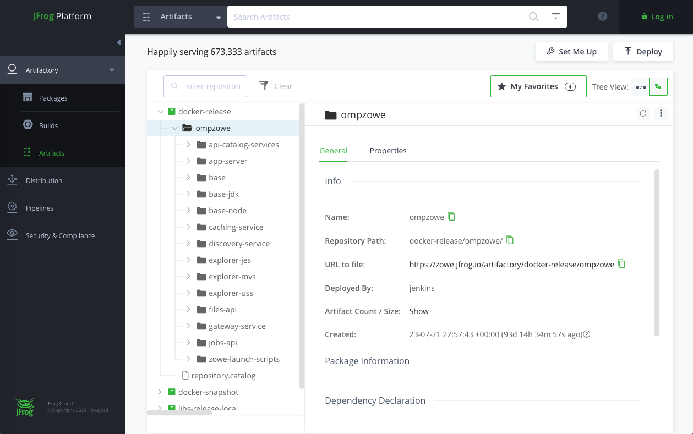
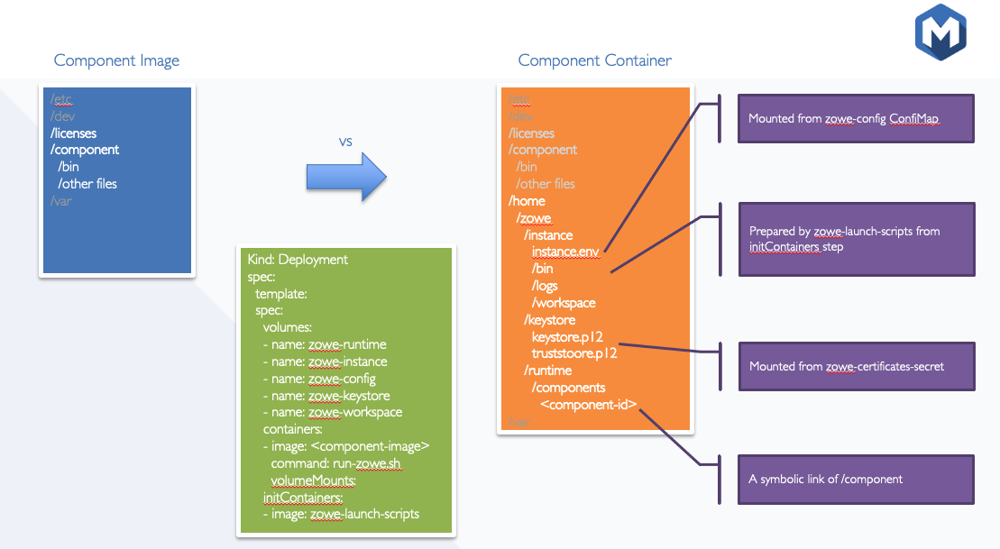
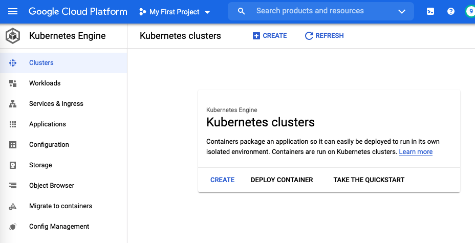
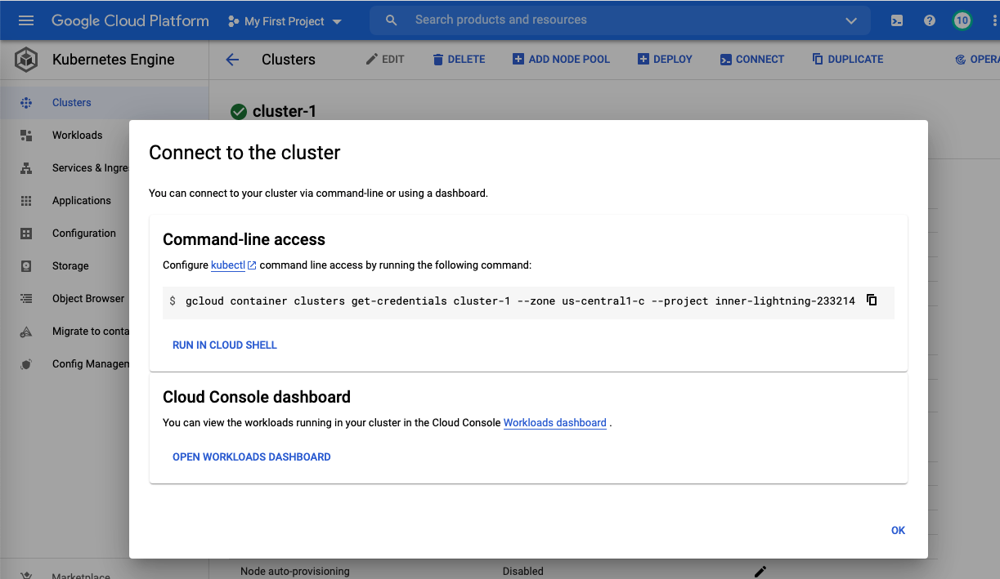

# Tutorial to start Zowe in Kubernetes

{Core} Can we run Zowe workloads off-platform in a container orchestration platform like Kubernetes? With v1.25.0, the answer is yes. In this new downloadable, we provide all the necessary Kubernetes manifest files you need to stand up Zowe.


This blog assumes you have basic knowledge of Zowe and Kubernetes, would like to take a closer look at the technical details, and even try out a lab exercise. If you are looking for general information about Zowe containerization, what and why, please check our other blog [Zowe Kubernetes Overview](zowe-k8s.md).

## Architecture view of Zowe Kubernetes deployment

Compared to deploying Zowe to z/OS system, as described in [Zowe architecture](https://docs.zowe.org/stable/getting-started/zowe-architecture), the following diagram depicts the difference in locations of Zowe components when deploying Zowe into Kubernetes cluster as opposed to running all components on a single z/OS system.


- Zowe System Services Server (aka `ZSS`) and Cross Memory Server (aka `ZIS`) are remaining on the z/OS side to communicate with z/OS native functions. Besides that, you have a choice to deploy all other components in Kubernetes.
- You can deploy Zowe to Kubernetes on any platform like,
  * setup from bare metal,
  * run on [Linux on IBM Z mainframe](https://www.ibm.com/it-infrastructure/z/os/linux),
  * provision from popular cloud vendors,
  * or just want to try it out with [Docker Desktop](https://docs.docker.com/desktop/kubernetes/) or [Minikube](https://minikube.sigs.k8s.io/docs/start/).
- All Zowe Kubernetes workloads are running on a dedicated namespace (`zowe` by default) to distinguish from other workloads in the same Kubernetes cluster.
- Zowe has its own `ServiceAccount` to help on managing permissions.
- Server components use similar `instance.env` or `zowe.yaml` on z/OS, which are stored in `ConfigMap` and `Secret`, to configure and start.
- Server components can be configured using the same certificates used on z/OS components.
- Zowe claims its own `Persistent Volume` to share files across components.
- Each server component is running in separated containers and can scale independently based on its own resource consumption.
- Components may register themselves to APIML Discovery with their own `Pod` name within the cluster.
- Zowe workloads use `zowe-launch-scripts` `initContainers` step to prepare required runtime directories.
- Only necessary components ports are exposed outside of Kubernetes with `Service` (or in combination with `Ingress`, OpenShift `Route`).

When deploying Zowe server components into container orchestration software like Kubernetes, we follow standard Kubernetes practices and the cluster can be monitored and managed with common Kubernetes administration methods.

# Zowe Images

For each Zowe core component image, we provide 2x2 flavors to cover:

- base image of latest Ubuntu and [Red Hat Universal Base Image](https://www.redhat.com/en/blog/introducing-red-hat-universal-base-image),
- CPU architecture of `amd64` (for x86 based CPU) and `s390x` (for Linux on Z mainframe).

Currently, our images are shipped in `zowe-docker-release.jfrog.io` registry, and you can find all images we released from https://zowe.jfrog.io/ui/repos/tree/General/docker-release%2Fompzowe.



For each image, we also release and update manifests to help you pick the right level of image based on your requirement. Typical image manifests we provide are:

- 1
- 1-ubuntu
- 1-ubi
- 1.25
- 1.25-ubuntu
- 1.25-ubi
- 1.25.0
- 1.25.0-ubuntu
- 1.25.0-ubi
- latest
- latest-ubuntu
- latest-ubi

For example, if you would like to automatically pick the most recent changes from v1 releases, you can use images like `zowe-docker-release.jfrog.io/ompzowe/gateway:1-ubuntu`.

These manifests covers both `amd64` and `s390x` CPU architecture, so it will work no matter you are running it in a distributed environment (typically x86 based CPU) or running on Linux on a Z mainframe.

## In-depth details of Zowe Kubernetes deployment

You can deploy Zowe to Kubernetes v1.19+ or compatible OpenShift v4.6+.

Depending on your Kubernetes or OpenShift setup, some of the configurations you may need to customize for your environment, especially for Persistent Volume, Networking, and your domain name to access Kubernetes and z/OS.

Here is a list of example Kubernetes manifests we provide you can customize based upon.

- `zowe` `Namespace` is a good start point to isolate your workload from others in the same cluster.
- A `ServiceAccount` `zowe-sa` is defined to help you customize the permission setup.
- Examples of defining `zowe-workspace-pvc` `PersistentVolumeClaim`. This persistent volume helps Zowe to share data between components. For example, one Desktop plugin may need to share its runtime to AppServer, or a static registered component may need to share its registration file to Discovery service. To define a `PersistentVolumeClaim`, you need to find out the appropriate `StorageClass` you can use across all possible Kubernetes nodes and support `ReadWriteMany` access mode.
- Example of `zowe-config` (and optional `zowe-certificates-cm`) `ConfigMap` and `zowe-certificates-secret` `Secret`. These configurations are similar to the `instance.env` or `zowe.yaml` you are using to start Zowe on z/OS. Zowe also ships a utility tools `<instance>/bin/utils/convert-fork8s.sh` to help you migrate the configurations and certificates from z/OS to Kubernetes.
- Example definitions of Zowe APIML API Catalog, Discovery and Gateway `Service`-s. `gateway-service` is the main service that must be exposed outside of Kubernetes and serves as entry point of Zowe. We also provide sample `Ingress` which may be needed in some setup. These networking definitions are very attached to your Kubernetes flavor like how your load balancer, Ingress controller is set up, what are the domain and port you would like to use, etc.
- One `discovery` `StatefulSet` and several `Deployments` match all other Zowe core components.
- A `cleanup-static-definitions` `CronJob` is predefined to help Zowe cleanup abandoned static definitions.
- Example `PodDisruptionBudget`s can help you maintain the availability of services.
- Example `HorizontalPodAutoscaler`s can help you scale Zowe based on CPU consumption of your workload.

We try to decouple Zowe runtime scripts from component runtime code so they can build and release independently. Zowe components, as well as extension images, have no requirement to contain Zowe runtime scripts. The Zowe context will be prepared when we start the component inside a Zowe cluster.



This picture illustrates directory changes when a component container is running in a Zowe cluster.

## Security Consideration

Security is always a top priority of running Zowe on any platform. Zowe follows Kubernetes common best practices and also Kubernetes Hardening Guidance from National Security Agency and Cybersecurity and Infrastructure Security Agency.

- Zowe conformant images must define `zowe` user and group other than using `root` user.
- Zowe prohibits starting component container with root user.
- Zowe example Deployments has predefined `securityContext` to limit runtime user, group, and file system group to `zowe`.
- Zowe launch script is started as PID 1 and will handle the SIGTERM signal properly by propagating to all child processes.
- By default Zowe example Deployments also enabled `readOnlyRootFilesystem` `securityContext` to protect the root file system from overwriting.
- Zowe core components are regularly scanned with security tools.
- Zowe workloads are isolated with Namespace and ServiceAccount.
- Zowe configurations and certificates can be securely stored in `Secret`, or potentially Vault to protect from unexpected access.
- You can still enable the strict `VERIFY_CERTIFICATES` option to achieve the best security like running Zowe on z/OS.

## Exercise deployment to Google Cloud

With the above knowledge, let's try to deploy Zowe into Google Cloud Kubernetes Engine. Hopefully, after this section, you may have a better understanding of how Zowe can be deployed and what are necessary customization may be required.

You will need a Google Cloud account, proper billing setup, Google Cloud CLI, and `kubectl` installed on your local computer. This step may cost you around $1 or $2 depends on how long you let your cluster runs.

1. Visit https://console.cloud.google.com/ and create your own project.

2. Choose Kubernetes Engine - Clusters from GCP menus. If you have never used this feature before, GCP may ask you to enable the feature before continuing.

3. Click on "Create" from the interface. 

4. Select either "GKE Standard" or "GKE Autopilot". I will choose "GKE Standard" for this demo.

5. Provide a name for your cluster, customize a zone close to you, then click on "CREATE" button. Then let's wait for your cluster to be ready. This may usually take 2-4 minutes.

6. Select the new cluster you just created, click on "CONNECT" button. This interface provides commands you need to prepare Kubernetes config context on your local computer. . Copy the command and run it on your local computer Terminal.

7. Now we can start to follow Zowe documentation to deploy Zowe. First, let's create Namespace and ServiceAccount:
  ```
  $ kubectl apply -f common/
  namespace/zowe created
  serviceaccount/zowe-sa created
  ```

8. The default storage class created by GKE doesn't support `ReadWriteMany` access mode. There are several ways to prepare your persistent volume for Zowe, here we will proceed with `Filestore`. Check this guidance https://cloud.google.com/filestore/docs/accessing-fileshares for more details.

  - 8a). Visit https://console.cloud.google.com/filestore/instances to create an instance. In this example, I will call the `Instance ID` as `zowe-workspace-filestore`, and `File share name` as `zowe_workspace`. All other options I choose to default, but customized to the zone I picked for my cluster. Click on "CREATE" and wait for your Filestore to be ready. This may usually take several minutes.

  - 8b). Check your newly created Filestore instance, pay attention to the information showing in this section "NFS mount point":

  ```
  10.34.56.78:/zowe_workspace
  ```

  The IP and share name will be needed in the next step.

  - 8c). Prepare this YAML file and save as `samples/google-cloud/workspace-pvc.yaml`.

  ```yaml
  ---
  apiVersion: v1
  kind: PersistentVolume
  metadata:
    name: zowe-workspace-pv
    namespace: zowe
  spec:
    capacity:
      storage: 10G
    accessModes:
    - ReadWriteMany
    nfs:
      # FIXME: this should be Filestore instance file share name and IP address.
      path: /zowe_workspace
      server: 12.34.56.78
  ---
  apiVersion: v1
  kind: PersistentVolumeClaim
  metadata:
    name: zowe-workspace-pvc
    namespace: zowe
    labels:
      app.kubernetes.io/name: zowe
      app.kubernetes.io/instance: zowe
      app.kubernetes.io/managed-by: manual
  spec:
    storageClassName: ""
    volumeName: zowe-workspace-pv
    accessModes:
      - ReadWriteMany
    resources:
      requests:
        storage: 50Mi
  ```

  - 8d). Apply the YAML file just created:

  ```
  $ kubectl apply -f samples/google-cloud/workspace-pvc.yaml
  persistentvolume/zowe-workspace-pv created
  persistentvolumeclaim/zowe-workspace-pvc created
  ```

  To verify if your `PersistentVolumeClaim` is configured properly, run

  ```
  $ kubectl get pvc -n zowe
  NAME                 STATUS   VOLUME              CAPACITY   ACCESS MODES   STORAGECLASS   AGE
  zowe-workspace-pvc   Bound    zowe-workspace-pv   10G        RWX                           3m4s
  ```

  If you see `STATUS` is `Bound`, you can move to the next step.

9. Define Zowe services by running this command. We choose `LoadBalancer` service in this demo:

  ```
  $ kubectl apply -f samples/api-catalog-service.yaml -f samples/gateway-service-lb.yaml -f samples/discovery-service-lb.yaml 
  service/api-catalog-service created
  service/gateway-service created
  ```

  From the GKE console, check `Services & Ingress` and wait for all services status are OK and Endpoints are available like this .

10. Prepare ConfigMaps and Secret. Now login to your z/OS system, switch to the instance directory where you started the Zowe ZSS server, and run this command:

  ```
  cd <instance-dir>
  ./bin/utils/convert-for-k8s.sh -x "35.192.15.148"
  ```

  Please note the IP showing above is the `gateway-service` external IP showing in step 9.

  Follow the instructions shown on the screen and copy all the content of ConfigMaps and Secret and save it to your local computer. Now apply the configs to your cluster by running:

  ```
  $ kubectl apply -f my-configs.yaml 
  configmap/zowe-config created
  configmap/zowe-certificates-cm created
  secret/zowe-certificates-secret created
  ```

11. Apply Zowe workloads by running

  ```
  $ kubectl apply -f workloads/instance-env/
  deployment.apps/api-catalog created
  deployment.apps/app-server created
  deployment.apps/caching created
  cronjob.batch/cleanup-static-definitions created
  statefulset.apps/discovery created
  deployment.apps/explorer-jes created
  deployment.apps/explorer-mvs created
  deployment.apps/explorer-uss created
  deployment.apps/files-api created
  deployment.apps/gateway created
  deployment.apps/jobs-api created
  ```

  Check `Workloads` menu from the GKE console, wait until all workloads' statuses are OK. This may take about 3-5 minutes. .

12. Congratulations, now you can access your Zowe instance running in the Kubernetes by accessing the `gateway-service` external IP. In my case, it's https://35.192.15.148:7554/. Once all services are ready, you should see 3 green checkmarks.

13. You can use your common Kubernetes operations practice. For example, examine logs from Zowe containers .

14. Once you have done your testing, you can delete the cluster you created, as well as the Filestore instance.

## Conclusion

If you follow this introduction and successfully deployed your Zowe workload to your Kubernetes, now it's time to explorer the functions provided by Zowe and the high availability, high scalability, ease of maintenance inherited from Kubernetes.

---

"If you enjoyed this blog checkout more [Zowe blogs here](https://medium.com/zowe). Or, ask a question and join the conversation on the [Open Mainframe Project Slack Channel](https://slack.openmainframeproject.org/) #Zowe-dev, #Zowe-user or #Zowe-onboarding. If this is your first time using the OMP slack channel register [here](https://slack.openmainframeproject.org/)."
