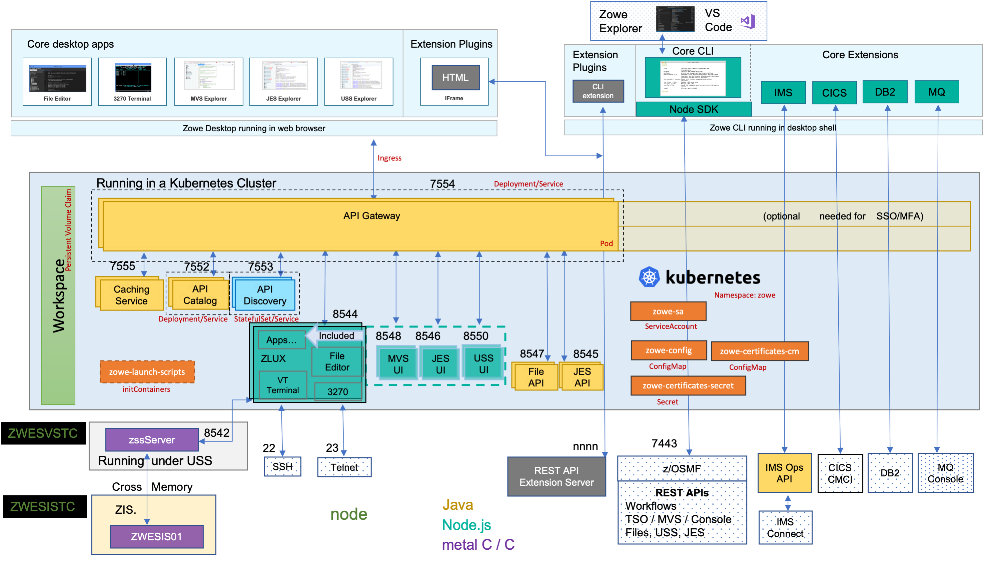
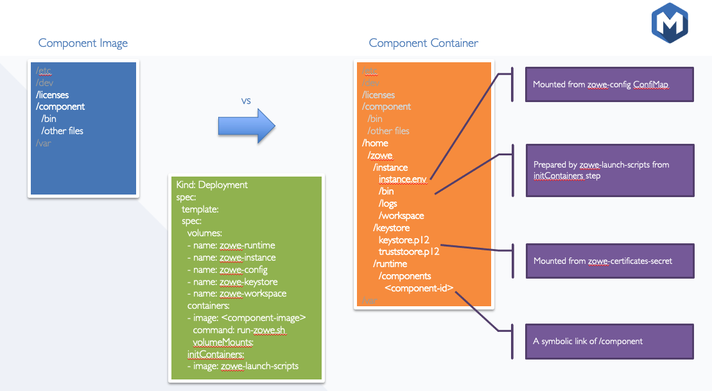
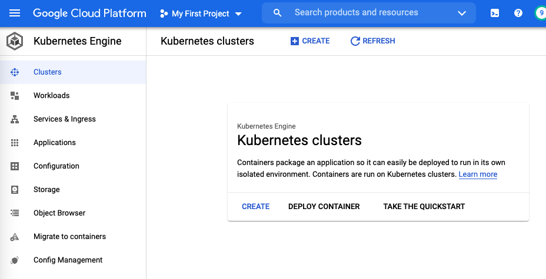
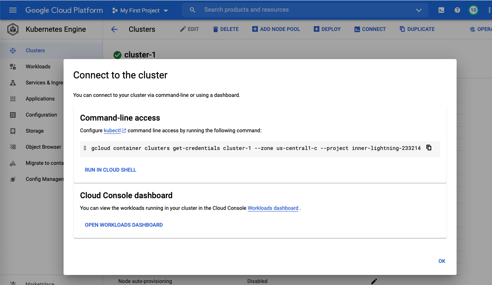
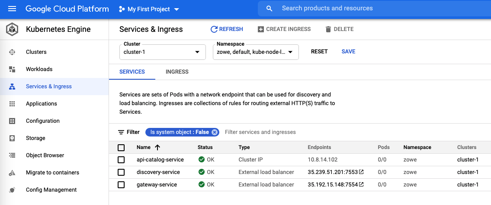
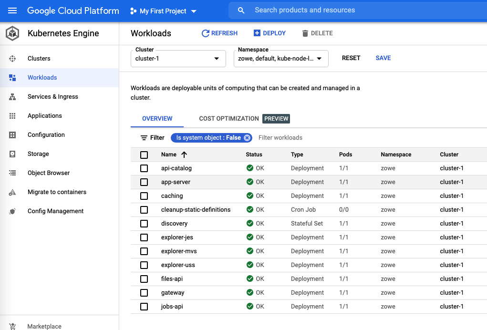
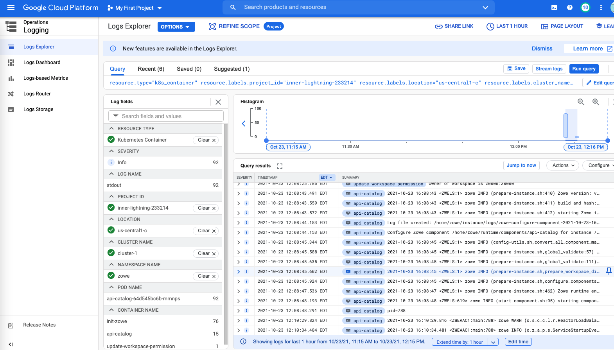

# Running Zowe in Kubernetes

{Core} Can we run Zowe workloads off platform in a container orchestration platform like Kubernetes? With v1.25.0, the answer is yes. In this new downloadable, we provide all the necessary Kubernetes manifest files you need to stand up Zowe.


## What is container and Kubernetes

Containers are **lightweight**, **executable** application components that combine application executable with all the operating system (OS) libraries and dependencies required to run the software in any environment. Containers take advantage of a form of operating system (OS) virtualization that lets multiple applications share a single instance of an OS by **isolating** processes and controlling the amount of CPU, memory, and disk those processes can access.


Kubernetes is a **container orchestration platform** for scheduling and automating the containerized applications deployment, networking, scalability, and availability. If you want to know more about Kubernetes, [kubernetes.io](https://kubernetes.io/docs/home/) will be the best place to start.

## Why containerization?

Containerization in general and Kubernetes provide many benefits like,

- **Portability**: A container is able to run uniformly and consistently across any platform or cloud.
- **Fault isolation**: Each containerized application is isolated and operates independently of others.
- **Efficiency**: Software running in containerized environments shares the machine’s OS kernel, and application layers within a container can be shared across containers.
- **Security**: The isolation of applications as containers inherently prevents the invasion of malicious code from affecting other containers or the host system.
- **Ease of management**: Kubernetes automates the application lifecycle, including:
  * **Deployment**: Deploy containers and keep them running in a desired state.
  * **Rollouts**: Kubernetes lets you initiate, pause, resume, or roll back rollouts to update your application.
  * **Service discovery**: Kubernetes can expose a service to external or within the cluster.
  * **Storage provisioning**: Kubernetes can mount local or cloud storage for application.
  * **Load balancing**: Kubernetes can distribute the workload based on CPU utilization or custom metrics.
  * **Autoscaling**: Kubernetes autoscaling can spin up or drain containers based on realtime workload.
  * **Self-healing for high availability**: Kubernetes can restart or replace failed containers to prevent downtime.

## Overview of Zowe Kubernetes deployment

When deploying other server components into container orchestration software like Kubernetes, Zowe follows standard Kubernetes practices and the cluster can be monitored and managed with common Kubernetes administration methods.

The following diagram depicts the difference in locations of Zowe components when deploying Zowe into Kubernetes cluster as opposed to running all components on a single z/OS system.



- Zowe `ZSS` and Cross Memory (also known as `ZIS`) server are remaining on z/OS side to communicate with z/OS native functions. Besides that, you have choice to deploy all other components in Kubernetes.
- You can deploy Zowe to Kubernetes on any platform like,
  * setup from bare metal,
  * run on [Linux on IBM Z mainframe](https://www.ibm.com/it-infrastructure/z/os/linux),
  * provision from popular cloud vendors,
  * or just want to try it out with [Docker Desktop](https://docs.docker.com/desktop/kubernetes/) or [Minikube](https://minikube.sigs.k8s.io/docs/start/).
- All Zowe Kubernetes workloads are running on a dedicated namespace (`zowe` by default) to distinguish from other workloads in same Kubernetes cluster.
- Zowe has it's own `ServiceAccount` to help on managing permissions.
- Server components uses similar `instance.env` or `zowe.yaml` on z/OS, which are stored in `ConfigMap` and `Secret`, to configure and start.
- Server components can be configured using same certificates used on z/OS components.
- Zowe claims it's own `Persistent Volume` to share files across components.
- Each server components are running in separated containers and can scale independently based on it's own resource consumption.
- Components may register themselves to Discovery with their own `Pod` name within the cluster.
- Zowe workloads use `zowe-launch-scripts` `initContainers` step to prepare required runtime directories.
- Only necessary components ports are exposed outside of Kubernetes with `Service` (or in combination with `Ingress`, OpenShift `Route`).

## In-depth details of Zowe Kubernetes deployment

You can deploy Zowe to Kubernetes v1.19+ or compatible OpenShift v4.6+.

Depends on you Kubernetes or OpenShift setup, some of the configurations you may need to customize for your environment, especially for Persistent Volume, Networking and your domain name to access Kubernetes and z/OS.

Here are list of example Kubernetes manifests we provide you can customize based upon.

- `zowe` `Namespace` is a good start point to isolate your workload from others in same cluster.
- A `ServiceAccount` `zowe-sa` is defined to help you customize permission setup.
- Examples of defining `zowe-workspace-pvc` `PersistentVolumeClaim`. This persistent volume helps Zowe to share data between components. For example, one Desktop plugin may need to share it's runtime to AppServer, or a static registered component may need to share it's registration file to Discovery service. To define a `PersistentVolumeClaim`, you need to find out appropriate `StorageClass` you can use across all possible Kubernetes nodes and support `ReadWriteMany` access mode.
- Example of `zowe-config` (and optional `zowe-certificates-cm`) `ConfigMap` and `zowe-certificates-secret` `Secret`. These configurations are similar to the `instance.env` or `zowe.yaml` you are using to start Zowe on z/OS. Zowe also ships a utility tools `<instance>/bin/utils/convert-fork8s.sh` to help you migrate the configurations and certificates from z/OS to Kubernetes.
- Example definitions of Zowe API Catalog, Discovery and Gateway `Service`-s. `gateway-service` is the main service must be exposed outside of Kubernetes and serves as entrypoint of Zowe. We also provide sample `Ingress` which may be needed in some setup. This networking definitions are very attached to your Kubernetes flavor like how your load balancer, Ingress controller are setup, what are the domain and port you would like to use, etc.
- One `discovery` `StatefulSet` and several `Deployments` matches all other Zowe core components.
- A `cleanup-static-definitions` `CronJob` is predefined to help Zowe cleanup abandoned static definitions.
- Example `PodDisruptionBudget`s can help you maintain availability of services.
- Example `HorizontalPodAutoscaler`s can help you scale Zowe based on CPU consumption of your workload.

For each Zowe core component, we provide 2x2 flavors to cover:

- base image of latest Ubuntu and [Red Hat Universal Base Image](https://www.redhat.com/en/blog/introducing-red-hat-universal-base-image),
- CPU architecture of `amd64` (for x86 based CPU) and `s390x` (for Linux on Z mainframe).

We try to decouple Zowe runtime scripts from component runtime code so they can build and release independently. Zowe component, as well as extension images have no requirement to contain Zowe runtime scripts. The Zowe context will be prepared when we start the component inside Zowe cluster.



This picture illustrates directory changes when a component container is running in Zowe cluster.

## Example deployment to Google Cloud

With above knowledge, let's try to deploy Zowe into Google Kubernetes Engine. Hopefully after this section, you may have better understanding how Zowe can be deployed and what are necessary customization required.

You will need a Google Cloud account, proper billing setup, Google cloud CLI and `kubectl` installed on your local computer. This step may cost you around $1 or $2 depends on how long you let your cluster runs.

1. Visit https://console.cloud.google.com/ and create your own project.

2. Choose Kubernetes Engine - Clusters from GCP menus. If you never use this feature before, GCP may ask you to enable the feature before continue.

3. Click on "Create" from the interface. 

4. Select either "GKE Standard" or "GKE Autopilot". I will choose "GKE Standard" for this demo.

5. Provide a name for your cluster, customize zone close to you, then click on "CREATE" button. Then let's wait for your cluster is ready. This may usually take 2-4 minutes.

6. Select the new cluster you just created, click on "CONNECT" button. This interface provide commands you need to prepare Kubernetes config context on your local computer. . Copy the command and run on your local computer Terminal.

7. Now we can start to follow Zowe documentation to deploy Zowe. First, let's create Namespace and ServiceAccount:
  ```
  $ kubectl apply -f common/
  namespace/zowe created
  serviceaccount/zowe-sa created
  ```

8. The default storage class created by GKE doesn't support `ReadWriteMany` access mode. There are several ways to prepare your persistent volume for Zowe, here we will proceed with `Filestore`. Check this guidance https://cloud.google.com/filestore/docs/accessing-fileshares for more details.

  - 8a). Visit https://console.cloud.google.com/filestore/instances to create an instance. In this example, I will call the `Instance ID` as `zowe-workspace-filestore`, and `File share name` as `zowe_workspace`. All other options I choose default, but customized to the zone I picked for my cluster. Click on "CREATE" and wait for your Filestore to be ready. This may usually take several minutes.

  - 8b). Check your newly created Filestore instance, pay attention to the information showing in this section "NFS mount point":

  ```
  10.34.56.78:/zowe_workspace
  ```

  The IP and share name will be needed in next step.

  - 8c). Prepare this YAML file and save as `samples/google-cloud/workspace-pvc.yaml`.

  ```yaml
  ---
  apiVersion: v1
  kind: PersistentVolume
  metadata:
    name: zowe-workspace-pv
    namespace: zowe
  spec:
    capacity:
      storage: 10G
    accessModes:
    - ReadWriteMany
    nfs:
      # FIXME: this should be Filestore instance file share name and IP address.
      path: /zowe_workspace
      server: 12.34.56.78
  ---
  apiVersion: v1
  kind: PersistentVolumeClaim
  metadata:
    name: zowe-workspace-pvc
    namespace: zowe
    labels:
      app.kubernetes.io/name: zowe
      app.kubernetes.io/instance: zowe
      app.kubernetes.io/managed-by: manual
  spec:
    storageClassName: ""
    volumeName: zowe-workspace-pv
    accessModes:
      - ReadWriteMany
    resources:
      requests:
        storage: 50Mi
  ```

  - 8d). Apply the YAML file just created:

  ```
  $ kubectl apply -f samples/google-cloud/workspace-pvc.yaml
  persistentvolume/zowe-workspace-pv created
  persistentvolumeclaim/zowe-workspace-pvc created
  ```

  To verify if your `PersistentVolumeClaim` is configured properly, run

  ```
  $ kubectl get pvc -n zowe
  NAME                 STATUS   VOLUME              CAPACITY   ACCESS MODES   STORAGECLASS   AGE
  zowe-workspace-pvc   Bound    zowe-workspace-pv   10G        RWX                           3m4s
  ```

  If you see `STATUS` is `Bound`, you can move to next step.

9. Define Zowe services by running this command. We choose `LoadBalancer` service in this demo:

  ```
  $ kubectl apply -f samples/api-catalog-service.yaml -f samples/gateway-service-lb.yaml -f samples/discovery-service-lb.yaml 
  service/api-catalog-service created
  service/gateway-service created
  ```

  From GKE console, check `Services & Ingress` and wait for all services status are OK and Endpoints are available like this .

10. Prepare ConfigMaps and Secret. Now login to your z/OS system, switch to the instance directory where you started Zowe ZSS server, and run this command:

  ```
  cd <instance-dir>
  ./bin/utils/convert-for-k8s.sh -x "35.192.15.148"
  ```

  Please note the IP showing above is the `gateway-service` external IP showing in step 9.

  Follow the instructions showing on the screen and copy all the content of ConfigMaps and Secret and save to your local computer. Now apply the configs to your cluster by running:

  ```
  $ kubectl apply -f my-configs.yaml 
  configmap/zowe-config created
  configmap/zowe-certificates-cm created
  secret/zowe-certificates-secret created
  ```

11. Apply Zowe workloads by running

  ```
  $ kubectl apply -f workloads/instance-env/
  deployment.apps/api-catalog created
  deployment.apps/app-server created
  deployment.apps/caching created
  cronjob.batch/cleanup-static-definitions created
  statefulset.apps/discovery created
  deployment.apps/explorer-jes created
  deployment.apps/explorer-mvs created
  deployment.apps/explorer-uss created
  deployment.apps/files-api created
  deployment.apps/gateway created
  deployment.apps/jobs-api created
  ```

  Check `Workloads` menu from GKE console, wait until all workloads status are OK. This may take about 3-5 minutes. .

12. Congratulations, now you can access your Zowe instance running in the Kubernetes by accessing the `gateway-service` external IP. In my case, it's https://35.192.15.148:7554/. Once all services are ready, you should see 3 green check marks.

13. You can use your common Kubernetes operations practice. For example, examine logs from Zowe containers .

14. Once you done your testing, you can delete the cluster you created, as well as the Filestore instance.

## Containerize your Zowe extension

Zowe also provides necessary information to help extenders to containerize their extension and run inside Zowe cluster. We introduce new [Zowe Conformance Criteria Related to Containerization](https://github.com/zowe/zowe-install-packaging/blob/master/containers/conformance.md) and all Zowe core components are the first adopters of these conformance criteria. From this conformance documentation, you can find information of,

- what are the requirements to setup your base image.
- how to copy your code into the extension image.
- what are the requirements to start the extension container and how `zowe-launch-scripts` image can help you to prepare your extension to run in Zowe context.
- how to label, build, test and release your extension image.

## Security Consideration

Security is always top priority of running Zowe on any platform. Zowe follows Kubernetes common best practices and also Kubernetes Hardening Guidance from National Security Agency and Cybersecurity and Infrastructure Security Agency.

- Zowe conformant images must define `zowe` user and group other than using `root` user.
- Zowe prohibits to start component container with root user.
- Zowe example Deployments has predefined `securityContext` to limit runtime user, group and file system group to `zowe`.
- Zowe launch script is started as PID 1 and will handle SIGTERM signal properly by propagating to all child processes.
- By default Zowe example Deployments also enabled `readOnlyRootFilesystem` `securityContext` to protect root file system from overwriting.
- Zowe core components are regular scanned with security tools.
- Zowe workloads are isolated with Namespace and ServiceAccount.
- Zowe configurations and certificates can be securely stored in `Secret`, or potentially Vault to protect from unexpected access.
- You can still enable strict `VERIFY_CERTIFICATES` option to achieve best security like running Zowe on z/OS.

## Conclusion

If you follow this introduction and successfully deployed your Zowe workload to your Kubernetes, now it's time to explorer the functions provided by Zowe and high availability, high scalability, ease of maintenance inherited from Kubernetes.

---

"If you enjoyed this blog checkout more [Zowe blogs here](https://medium.com/zowe). Or, ask a question and join the conversation on the [Open Mainframe Project Slack Channel](https://slack.openmainframeproject.org/) #Zowe-dev, #Zowe-user or #Zowe-onboarding. If this is your first time using the OMP slack channel register [here](https://slack.openmainframeproject.org/)."
