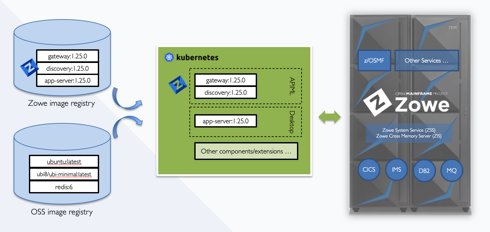

# Running Zowe in Kubernetes

{Core} Can we run Zowe workloads off-platform in a container orchestration platform like Kubernetes? With v1.25.0, the answer is yes. In this new downloadable, we provide all the necessary Kubernetes manifest files you need to stand up Zowe.

## What is container and Kubernetes

Containers are **lightweight**, **executable** application components that combine application executable with all the operating system (OS) libraries and dependencies required to run the software in any environment. Containers take advantage of a form of operating system (OS) virtualization that lets multiple applications share a single instance of an OS by **isolating** processes and controlling the amount of CPU, memory, and disk those processes can access.

Kubernetes is a **container orchestration platform** for scheduling and automating containerized applications deployment, networking, scalability, and availability. If you want to know more about Kubernetes, [kubernetes.io](https://kubernetes.io/docs/home/) will be the best place to start.

## Why containerization?

Containerization in general and Kubernetes provide many benefits like,

- **Portability**: A container can run uniformly and consistently across any platform or cloud.
- **Fault isolation**: Each containerized application is isolated and operates independently of others.
- **Efficiency**: Software running in containerized environments shares the machine’s OS kernel, and application layers within a container can be shared across containers.
- **Security**: The isolation of applications as containers inherently prevents the invasion of malicious code from affecting other containers or the host system.
- **Ease of management**: Kubernetes automates the application lifecycle, including:
  * **Deployment**: Deploy containers and keep them running in a desired state.
  * **Rollouts**: Kubernetes lets you initiate, pause, resume, or roll back rollouts to update your application.
  * **Service discovery**: Kubernetes can expose a service to external or within the cluster.
  * **Storage provisioning**: Kubernetes can mount local or cloud storage for an application.
  * **Load balancing**: Kubernetes can distribute the workload based on CPU utilization or custom metrics.
  * **Autoscaling**: Kubernetes autoscaling can spin up or drain containers based on real-time workload.
  * **Self-healing for high availability**: Kubernetes can restart or replace failed containers to prevent downtime.

## Overview of Zowe Kubernetes deployment

The following diagram shows how different Zowe components work together in a containerization deployment.

- Zowe System Service (aka `ZSS`) and Zowe Cross Memory Server (aka `ZIS`) are running on z/OS side to communicate with z/OS native functions.
- Other Zowe core components can run in containers, or a container orchestration platform like Kubernetes.
- Zowe containerization conformant extension can also run in a container and work with other Zowe components or other z/OS services.

Like the benefits we introduced in the previous section, when you run Zowe in Kubernetes, you automatically inherit all ease of management convenience and even more.

With Zowe APIML Gateway routing, your component may not even be aware of where the other services are located. Whether they are running on z/OS or running in another container, Zowe APIML Gateway and Discovery cover the differences and route the traffic to the target for you.

Zowe core components and your extension running in Kubernetes will remain maximum availability. If any of the components fail, Kubernetes will bring up a new component and serve your service consumers.

If you like to let Zowe APIML Gateway handle more workloads, you can simply scale up Gateway or even let Kubernetes automatically handle this for you. You almost have zero efforts to scale your component as long as you have enough resources that can be used.

When you want to upgrade Zowe, the Kubernetes standard `rollout` function can help you to upgrade all components with zero downtime.

## Containerize your Zowe extension

Zowe also provides necessary information to help extenders to containerize their extension and run inside a Zowe cluster. We introduce new [Zowe Conformance Criteria Related to Containerization](https://github.com/zowe/zowe-install-packaging/blob/master/containers/conformance.md) and all Zowe core components are the first adopters of these conformance criteria. From this conformance documentation, you can find information of,

- How to package z/OS agnostic and z/OS dependent extensions to make the best use of containers.
- What are the requirements to set up your base image.
- How to copy your code into the extension image.
- What are the requirements to start the extension container and how `zowe-launch-scripts` image can help you to prepare your extension to run in Zowe context.
- How to label, build, test and release your extension image.

## Conclusion

Hope this blog provides you with a comprehensive view of Zowe containerization, the purpose, and how you may benefit from this. If you have any questions, concerns, and suggestions on the new solution, please don't hesitate to contact us.

---

"If you enjoyed this blog checkout more [Zowe blogs here](https://medium.com/zowe). Or, ask a question and join the conversation on the [Open Mainframe Project Slack Channel](https://slack.openmainframeproject.org/) #Zowe-dev, #Zowe-user or #Zowe-onboarding. If this is your first time using the OMP slack channel register [here](https://slack.openmainframeproject.org/)."
